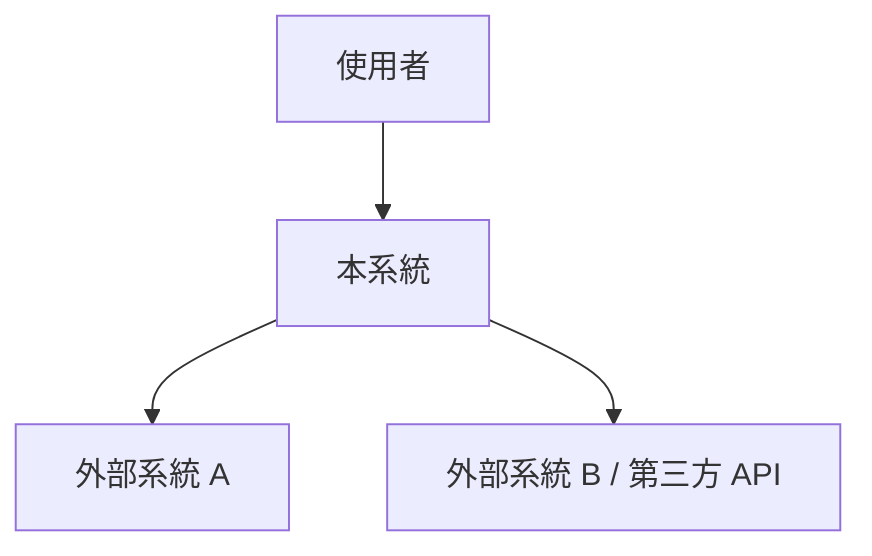
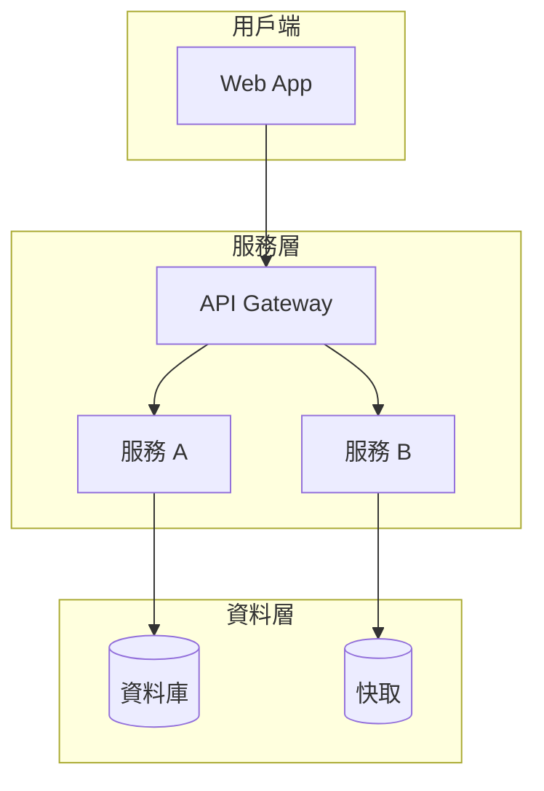
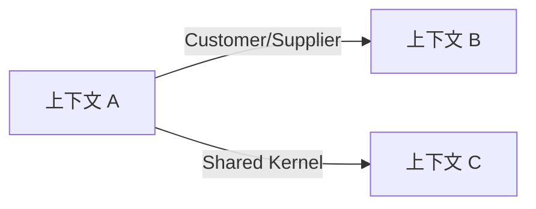
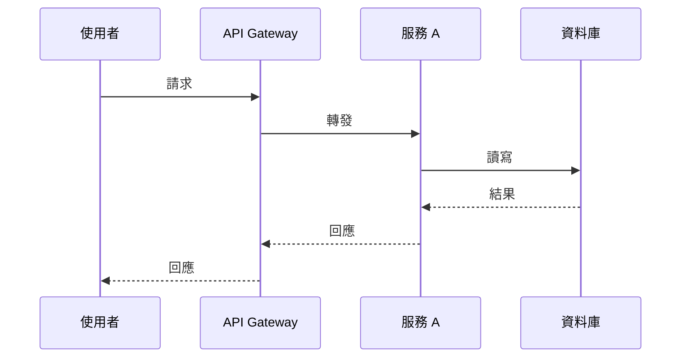
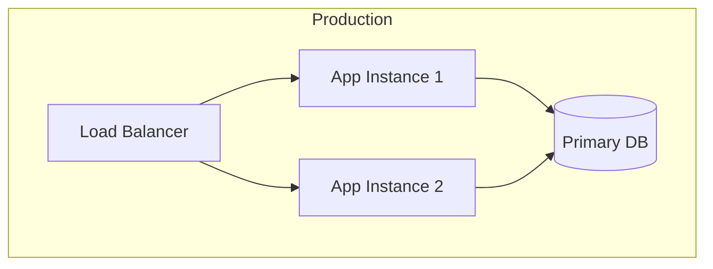
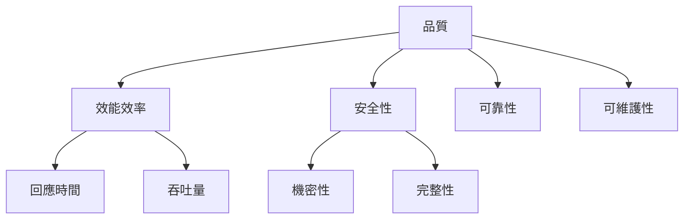

# 架構與設計文件 - [專案名稱]

> **版本:** v5.0 | **更新:** 2026-07-24 | **狀態:** 草稿/審核中/已批准
>
> 依 [arc42](https://arc42.org) 12 章骨架撰寫，圖表抽象層級採 [C4 Model](https://c4model.com)（Context → Container → Component → Code，另含 Dynamic / Deployment View）。ADR 全文不放此文件，本文件第 9 章只放索引，詳見對應 `04_architecture_decision_record_template.md` 產出的 ADR 檔。

---

## 1. Introduction & Goals（簡介與目標）

### 1.1 需求概述
- 系統一句話定位：[做什麼、為誰做]
- 核心業務目標：[3-5 項，對應 PRD North Star Metric]

### 1.2 品質目標（Top 3-5）

依 ISO 25010 挑選對本專案最關鍵的品質屬性，優先級排序（詳細情境見第 10 章）：

| 優先級 | 品質屬性 | 動機 |
| :--- | :--- | :--- |
| 1 | [例：效能] | [為何是第一優先] |
| 2 | [例：安全性] | |
| 3 | [例：可維護性] | |

### 1.3 利害關係人

| 角色 | 關注點 | 聯絡窗口 |
| :--- | :--- | :--- |
| [產品負責人] | [業務價值、上線時程] | |
| [維運團隊] | [可觀測性、告警] | |

---

## 2. Constraints（架構限制）

| 類型 | 限制內容 | 影響 |
| :--- | :--- | :--- |
| 技術限制 | [例：必須沿用現有 PostgreSQL] | |
| 組織限制 | [例：團隊規模、既有技能棧] | |
| 法規/合規 | [例：GDPR、個資法] | |
| 時程/預算 | [例：MVP 須於 X 週內上線] | |

---

## 3. Context & Scope（系統情境與範圍）＝ C4 L1

### 3.1 業務情境

- **範圍內**：[系統負責的業務能力]
- **範圍外**：[明確排除項，對應 PRD Non-Goals]

### 3.2 技術情境

| 介面 | 對象 | 協定/格式 | 說明 |
| :--- | :--- | :--- | :--- |
| | | REST/gRPC/Event | |

---

## 4. Solution Strategy（解決方案策略）

- **架構模式**：[微服務 / 模組化單體 / 事件驅動 / ...] — **選擇理由**：[簡述，詳細比較見對應 ADR]
- **技術選型摘要**：

| 分類 | 選用技術 | 選擇理由 | 備選方案 | ADR |
| :--- | :--- | :--- | :--- | :--- |
| 後端框架 | | | | ADR-XXX |
| 資料庫 | | | | ADR-XXX |
| 快取 | | | | |
| 訊息佇列 | | | | |
| 容器編排 | | | | |
| 可觀測性 | | | | |
| CI/CD | | | | |

- **達成品質目標的關鍵手段**：[對應 1.2 的每個品質目標，列出對應架構決策，1 行/項]

---

## 5. Building Block View（建構區塊視圖）＝ C4 L2/L3

### 5.1 容器圖（C4 L2）

| 容器/元件 | 核心職責 | 技術 | 依賴 |
| :--- | :--- | :--- | :--- |
| | | | |

### 5.2 元件圖（C4 L3，選填 — 核心容器內部模組）

[僅對複雜度高、需要拆解的容器補充]

### 5.3 DDD 戰略設計

> 若專案採 DDD，本節為權威來源；分層/類別層級細節見 `09_design_and_dependencies.md`。

- **通用語言（Ubiquitous Language）**：[核心業務術語詞彙表，術語 ↔ 程式碼命名一致]
- **限界上下文（Bounded Context）與 Context Map**：

| 上下文 | 職責 | 對應容器/服務 | 與其他上下文關係 |
| :--- | :--- | :--- | :--- |
| | | | Partnership / Customer-Supplier / Conformist / ACL |

### 5.4 資料架構

- **資料模型**：[ER 圖或核心聚合根說明]
- **一致性策略**：強一致：[場景] ／ 最終一致：[場景，含補償機制]
- **資料分類與合規**：PII 處理方式、加密策略（靜態/傳輸中）、保留與刪除策略

### 5.5 MVP 範圍與模組清單

- **關鍵模組（MVP 必含）**：[模組 1]、[模組 2]
- **後續模組**：[模組 3]

| 模組 | 對應 BDD | 職責 | API 設計 | 資料模型 |
| :--- | :--- | :--- | :--- | :--- |
| [名稱] | [連結] | [簡述] | → 見 `06_api_design_specification.md` | [Schema 或說明] |

---

## 6. Runtime View（運行時視圖）＝ C4 Dynamic

針對 2-4 個關鍵/高風險使用者旅程，畫出跨元件的動態互動：

### 場景：[例如：使用者下單]

- **步驟說明**：[步驟 1 → 2 → 3 的資料流描述，含失敗分支]

---

## 7. Deployment View（部署視圖）＝ C4 Deployment + IaC 對應

| 部署節點 | 對應 IaC 資源 | 環境 | 擴縮策略 |
| :--- | :--- | :--- | :--- |
| [例：App Server] | [Terraform module / Helm chart 名稱] | Dev/Staging/Prod | [水平自動擴展規則] |

- **CI/CD 流程**：[提交 → 測試 → 建置 → 部署的自動化流程，關鍵 gate]
- **環境策略**：Dev / Staging / Production 差異點
- **成本估算**：[主要成本驅動因素與優化策略]

---

## 8. Cross-Cutting Concepts（跨領域考量）

### 可觀測性
- 日誌：[格式/收集方案] | 指標：[SLI/SLO] | 追蹤：[方案] | 告警：[分級與升級策略]

### 安全性
- 威脅模型：[STRIDE 或簡述] | 認證授權：[方案] | 機密管理：[Vault/env] | 網路安全：[分段/防火牆規則]

### 錯誤處理策略
- [統一錯誤格式 → 詳見 `06_api_design_specification.md`] | 重試/斷路器策略 | 降級策略

### 設定管理
- [環境變數 vs 設定中心] | [Feature flag 策略]

### 其他跨領域概念（依專案需要增補）
- [國際化 / 無障礙 / 多租戶 / 快取失效策略 ...]

---

## 9. Architecture Decisions（架構決策索引）

> 全文不放此處，僅列索引；每筆對應一份 `04_architecture_decision_record_template.md` 產出的 ADR。

| ADR | 標題 | 狀態 | 摘要 |
| :--- | :--- | :--- | :--- |
| ADR-001 | | proposed/accepted/... | [1 句話] |

---

## 10. Quality Requirements（品質需求）

### 10.1 Quality Tree（品質樹）

依 ISO 25010 展開品質屬性子樹，標示對本專案的重要度：

### 10.2 Quality Scenarios（品質情境 — 取代單純數值需求表）

每個品質屬性至少寫 1 個可測試情境：情境（Scenario）＝ 來源 + 刺激（Stimulus）+ 環境（Environment）+ 產出物（Artifact）+ 回應（Response）+ 量測（Response Measure）。

| ID | 品質屬性 | 情境描述（刺激→回應） | 量測標準 |
| :--- | :--- | :--- | :--- |
| QS-01 | 效能 | 尖峰時段 1000 併發使用者送出下單請求 | P95 延遲 < 200ms |
| QS-02 | 可用性 | 單一 AZ 故障 | 服務持續可用，RTO < 5 分鐘 |
| QS-03 | 安全性 | 未授權 token 存取受保護端點 | 100% 拒絕並記錄 |
| QS-04 | 可維護性 | 新增一個欄位到既有實體 | 改動 ≤ 3 個檔案，無需改資料庫遷移以外的基礎設施 |

---

## 11. Risks & Technical Debt（風險與技術債）

### 風險

| 風險 | 可能性 | 影響 | 緩解策略 |
| :--- | :--- | :--- | :--- |
| | | | |

### 已知技術債

| 技術債 | 產生原因 | 影響範圍 | 償還計畫 |
| :--- | :--- | :--- | :--- |
| | | | |

### 演進路線

- **Phase 1 (MVP)**：[範圍與目標]
- **Phase 2 (擴展)**：[範圍與目標]
- **Phase 3 (成熟)**：[範圍與目標]

---

## 12. Glossary（詞彙表）

| 術語 | 定義 | 備註 |
| :--- | :--- | :--- |
| | | [對應 5.3 通用語言，避免重複維護，可互相連結] |
