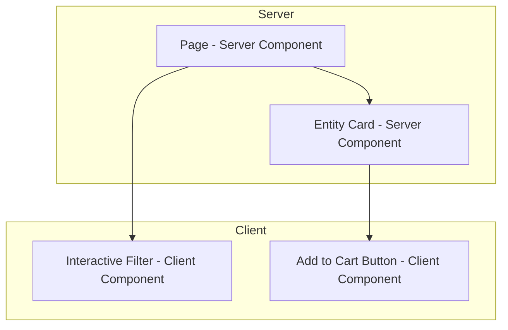

# 前端架構規範 - [專案名稱]

> **版本:** v2.0 | **更新:** 2026-07-24 | **狀態:** 草稿/已批准
> **適用:** React/Next.js（RSC）為主，其他框架可對應調整第 2、3 部分

---

## 第 1 部分: 架構目標

| 維度 | 目標 | 衡量指標 |
| :--- | :--- | :--- |
| **效能** | 載入速度與回應速度 | LCP, INP, CLS（見第 5 部分效能預算） |
| **可用性** | 使用者完成目標的難易度 | 任務成功率、SUS 分數 |
| **可維護性** | 團隊迭代效率、切片邊界清晰 | 複雜度、覆蓋率、跨切片依賴數 |
| **可靠性** | 各環境穩定運行 | 錯誤率、崩潰率、MTBF |

> **註：** Core Web Vitals 已用 **INP**（Interaction to Next Paint）取代 FID（2024 起生效）。

---

## 第 2 部分: Feature-Sliced Design 分層

採用 [FSD](https://feature-sliced.design/)（業務切片，取代純技術分層的 Atomic Design）。**依賴規則：只能由上層往下層 import，同層互不 import，跨切片一律經 `shared` 或公開 API。**

```
app/         -- 應用初始化：routing、providers、全局樣式、entry point
pages/       -- 頁面組合（Next.js 專案由 app router 對應，此層可能極薄）
widgets/     -- 獨立的頁面區塊組合（Header、Sidebar、ProductCard 組合體）
features/    -- 使用者互動場景（AddToCart、LoginForm、SearchFilter）
entities/    -- 業務實體（User、Product、Order 的資料模型 + 展示元件）
shared/      -- 與業務無關的共用層（UI kit、utils、api client、config）
```

### 各層職責與技術選型

| 層級 | 職責 | 可 import | 技術選項 |
| :--- | :--- | :--- | :--- |
| app | 全局配置、Provider 組裝、路由掛載 | 以下所有層 | [Next.js App Router / React Router] |
| pages | 組裝 widgets/features 成完整頁面 | widgets, features, entities, shared | — |
| widgets | 可複用的複合區塊 | features, entities, shared | — |
| features | 一個使用者動作的完整實作（UI+邏輯+API） | entities, shared | [React Hook Form/Formik] |
| entities | 業務實體的資料模型與最小展示單元 | shared | [Zod schema, TanStack Query] |
| shared | UI kit、工具、設定、API 基礎設施 | （不 import 任何業務層） | [Tailwind/CSS Modules] + [Vite/webpack] |

每個切片（slice）內部再依 `ui / model / api / lib` 分段，並透過 `index.ts` 暴露公開 API，禁止跨切片深層 import 內部檔案。

---

## 第 3 部分: RSC（Server/Client）邊界

React Server Components 時代，元件樹的 Server/Client 邊界需**顯式規劃**，不可事後補。

### 3.1 邊界決策表

| 情境 | 選 Server Component | 選 Client Component (`'use client'`) |
| :--- | :--- | :--- |
| 讀資料庫/內部 API、無互動 | ✅ 預設 | |
| 需要 `useState`/`useEffect`/事件處理 | | ✅ |
| 存取瀏覽器 API（`window`、`localStorage`） | | ✅ |
| 使用 Context / 第三方僅支援 client 的套件 | | ✅ |
| 純展示、無狀態的 UI 元件 | ✅ 優先 | 僅在父層已是 client 時退化為 client |

**Composition 規則：** Client Component 可透過 `children` prop 包裹 Server Component（不可反向 import）；避免把整棵樹標成 `'use client'` 導致邊界失效。

### 3.2 資料獲取策略

| 策略 | 適用層 | 說明 |
| :--- | :--- | :--- |
| Server Component 直讀 | entities / pages（server） | 直接 `await fetch()` 或呼叫 DB/ORM，無需額外 client state |
| Server Actions | features（mutation） | 表單提交、寫入操作，取代傳統 API route + client fetch |
| Client fetch（TanStack Query/SWR） | features（需輪詢、樂觀更新、即時互動） | 搭配 server 端預取（`prefetchQuery` + hydration）降低首屏延遲 |
| Streaming + Suspense | pages | 分段渲染，`loading.tsx` / `<Suspense>` 邊界對應資料獲取邊界 |

### 3.3 邊界圖範例



---

## 第 4 部分: 狀態管理

**核心原則：先分類 State 種類，再選工具；不要用同一套機制混管所有狀態。**

| State 種類 | 定義 | 建議工具 | 存放層 |
| :--- | :--- | :--- | :--- |
| **Server State** | 源自後端、可被伺服器覆寫的資料（列表、詳情） | TanStack Query / SWR / RSC 直讀 | entities |
| **Client State** | 純前端 UI 狀態（modal 開關、表單草稿） | useState / Zustand（跨元件時） | features |
| **URL State** | 需可分享/可回上一頁的狀態（篩選、分頁、tab） | URL search params（`useSearchParams`） | pages/features |
| **Global App State** | 認證身分、主題、語系 | Context / 輕量 store（Zustand/Jotai） | app |

**禁止：** 把 server state（API 回傳資料）塞進全局 Redux/Zustand store 長期快取——交給資料獲取庫管理 cache/revalidate/staleTime。

---

## 第 5 部分: Design Tokens（W3C DTCG 2025.10）

採用 [W3C Design Tokens Community Group](https://tr.designtokens.org/format/) 2025.10 穩定格式：廠商中立 JSON、支援 multi-file 與 theming。

### 5.1 三層分層

| 層級 | 說明 | 範例檔案 |
| :--- | :--- | :--- |
| **Global（原始值）** | 不帶語意的原始設計值 | `tokens/global.tokens.json` — `blue.500 = #3B82F6` |
| **Alias / Semantic（語意）** | 引用 global，賦予用途語意 | `tokens/semantic.tokens.json` — `color.action.primary = {global.blue.500}` |
| **Component（元件級）** | 引用 semantic，綁定特定元件 | `tokens/component.tokens.json` — `button.primary.bg = {color.action.primary}` |

### 5.2 DTCG 格式範例

```json
{
  "color": {
    "action": {
      "primary": {
        "$value": "{color.blue.500}",
        "$type": "color",
        "$description": "主要互動色，用於主按鈕/連結"
      }
    }
  }
}
```

### 5.3 同步流程

```
Figma（設計來源）
   → Token Studio / Figma Variables 匯出 DTCG JSON
   → Style Dictionary 轉譯
   → tokens/*.tokens.json（版控，SSOT）
   → 產出 Tailwind config / CSS variables / 各平台格式
```

- 設計端變更一律先改 Figma variables → 匯出 → PR review → 產出程式碼，**禁止**手動修改產出的 CSS/Tailwind config 反向漂移。
- Dark mode / 多品牌主題透過切換 semantic 層的 token set 實現，不重寫 component 層。

### 5.4 元件分層

沿用 FSD 的 `shared/ui`（原子級元件庫）作為 component tokens 的唯一消費者：

```
shared/ui/   → Button, Input, Icon, Badge（消費 component tokens）
entities/*/ui → 業務實體展示元件（組合 shared/ui）
widgets/     → 複合區塊（組合 entities + features）
```

---

## 第 6 部分: 效能預算

### 6.1 Core Web Vitals 目標

| 指標 | 目標 | 優化策略 |
| :--- | :--- | :--- |
| LCP | < 2.5s | 圖片優化、預載關鍵資源、Server Component 首屏直出 |
| **INP** | < 200ms | 減少長任務、事件處理去抖、避免大型 client bundle 阻塞互動 |
| CLS | < 0.1 | 圖片/影片設定尺寸、避免動態插入內容、字型 `font-display: swap` |

### 6.2 Bundle Size 上限

| 範圍 | 上限（gzip） | 監控方式 |
| :--- | :--- | :--- |
| 首屏 JS（route chunk） | < 150 KB | CI 內建 bundle analyzer + 門檻檢查 |
| 單一 Client Component chunk | < 50 KB | 超標需拆分或改回 Server Component |
| CSS 總量 | < 50 KB | PurgeCSS / Tailwind JIT |

### 6.3 載入優化

- **Code Splitting**：路由級 + 動態 `import()`；Client Component 邊界即天然分割點
- **資源優化**：圖片壓縮（WebP/AVIF）、`next/image` 等內建優化元件、字型子集化
- **快取策略**：CDN + HTTP Cache、`fetch` 的 `cache`/`revalidate` 選項、Service Worker（PWA 場景）

---

## 第 7 部分: 可用性與無障礙

### 響應式設計斷點

| 名稱 | 寬度 | 目標裝置 |
| :--- | :--- | :--- |
| xs | < 576px | 手機 (直向) |
| sm | >= 576px | 手機 (橫向) |
| md | >= 768px | 平板 |
| lg | >= 992px | 筆電 |
| xl | >= 1200px | 桌面 |

### 無障礙 (A11y) 要求

- WCAG 2.1 AA 等級
- 語義化 HTML、ARIA 標籤（優先原生語義，ARIA 為補充）
- 鍵盤導航完整支援、焦點順序符合視覺順序
- 色彩對比度 >= 4.5:1（大字級 >= 3:1）
- 焦點管理與螢幕閱讀器支援；Client Component 互動需驗證 focus trap（modal/drawer）

### 國際化 (i18n)

- 工具：[next-intl / react-intl / vue-i18n]
- 日期/數字格式化使用 `Intl` API
- RTL 佈局支援（如需要）

---

## 第 8 部分: 測試策略對應

依 FSD 分層與 RSC 邊界對應測試層級：

| 分層/邊界 | 測試類型 | 工具 | 覆蓋率目標 |
| :--- | :--- | :--- | :--- |
| shared（工具/hooks） | 單元測試 | Vitest/Jest | 80%+ |
| entities（資料模型/展示） | 單元 + 快照 | Vitest + Testing Library | 80%+ |
| features（互動場景） | 元件整合測試 | Testing Library（mock server state） | 核心場景全覆蓋 |
| Server Component 資料獲取 | 整合測試（mock fetch/DB） | Vitest + MSW | 關鍵路徑 |
| pages（跨切片組合） | E2E | Playwright | 關鍵使用者旅程 |
| Design Tokens/視覺 | 視覺回歸 | Storybook + Chromatic | 元件庫全量 |

---

## 第 9 部分: 前後端協作

### API 通訊規範

- 統一使用 API Client 封裝（`shared/api`），不在 features/entities 內直接呼叫 `fetch`
- 請求/回應型別自動生成（從 OpenAPI）
- 統一錯誤處理（對應 RFC 9457 Problem Details）+ 使用者提示

### 認證與授權

- Token 儲存：httpOnly Cookie（優先）/ Server-only session
- 自動重整 Token 機制（Server Action 或 middleware）
- 路由守衛（認證/角色），優先在 Server Component / middleware 層攔截

---

## 第 10 部分: 監控與安全

### 前端監控

- 效能：Core Web Vitals 收集（`web-vitals`，含 INP）
- 錯誤：Sentry / 全局錯誤邊界（`error.tsx`）
- 行為：頁面瀏覽、互動事件追蹤

### 前端安全

- [ ] XSS 防護（框架自動跳脫 + CSP）
- [ ] CSRF 防護（SameSite Cookie / Server Action 內建保護）
- [ ] 敏感資料不存 localStorage，不落入 Client Component props
- [ ] 依賴掃描 (npm audit / Snyk)
- [ ] Subresource Integrity (CDN 資源)

---

## 第 11 部分: 工程化實踐

### 專案結構（FSD 對應目錄）

```
src/
├── app/             # 全局配置、routing、providers
├── pages/           # 頁面組合（或對應 Next.js app/ 目錄）
├── widgets/         # 複合區塊
├── features/        # 使用者互動場景
├── entities/        # 業務實體
├── shared/
│   ├── ui/          # 元件庫（消費 design tokens）
│   ├── api/         # API client 封裝
│   ├── lib/         # 工具函式
│   ├── config/      # 環境設定
│   └── tokens/      # DTCG design tokens
```

### 程式碼品質

- Linter: ESLint（含 FSD 分層依賴規則 plugin）+ Prettier
- 型別: TypeScript strict mode
- 提交: Conventional Commits + commitlint
- 分支: Git Flow / Trunk-Based

---

## 第 12 部分: 開發檢查清單

### 新功能上線前

- [ ] 切片歸屬正確（無跨層違規 import）
- [ ] Server/Client 邊界已顯式標註，client bundle 未過度膨脹
- [ ] TypeScript 無錯誤
- [ ] 單元/整合/E2E 測試通過（見第 8 部分）
- [ ] Design tokens 無硬編碼值
- [ ] 響應式設計驗證
- [ ] 無障礙基本檢查
- [ ] 效能預算未超標（LCP/INP/CLS + bundle size）
- [ ] 安全檢查清單通過
- [ ] Code Review 通過
