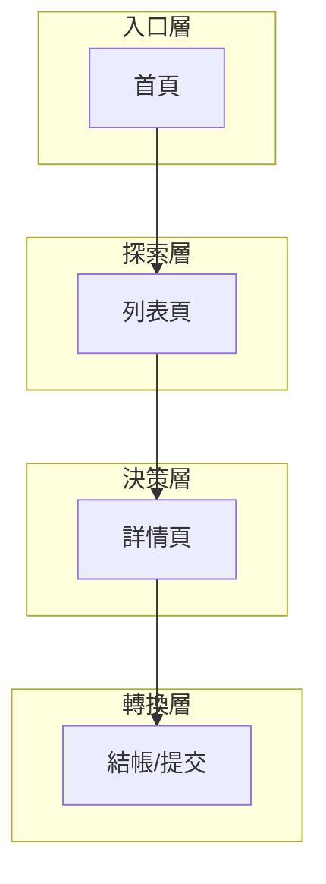

# 前端資訊架構規範 - [專案名稱]

> **版本:** v2.0 | **更新:** 2026-07-24 | **狀態:** 草稿/已批准
> **相關文檔:** [PRD](./02_project_brief_and_prd.md) | [前端架構](./12_frontend_architecture_specification.md)

---

## 1. 目的與範圍

**目的**: 定義 [專案名稱] 前端的完整資訊架構，作為開發與設計的 SSOT。

| 範圍 | 說明 |
| :--- | :--- |
| **包含** | 頁面資訊架構、使用者旅程、導航設計、URL 規範、頁面↔資料對應、無障礙要求 |
| **不包含** | 視覺設計細節、元件實現、後端 API 內部邏輯 |

---

## 2. 設計原則

**核心價值主張:** 「[一句話描述為使用者提供的核心價值]」

### 資訊架構原則

| 原則 | 說明 |
| :--- | :--- |
| 簡化 | 保留: [核心功能] / 移除: [排除功能] / 專注: [聚焦點] |
| 認知負荷 | 每頁 1 個主要目標，先總覽再深入 |
| 架構模式 | [ ] 扁平化 / [ ] 層級化 / [ ] 中心輻射 / [ ] 混合 |

---

## 3. 資訊架構總覽

### 系統層次結構

### 頁面總覽

| # | 路由 | 頁面名稱 | 主要職責 | 使用者目標 | 層級 |
| :--- | :--- | :--- | :--- | :--- | :--- |
| 0 | `/` | 首頁 | [職責] | [目標] | L0 |
| 1 | `/[path]` | [名稱] | [職責] | [目標] | L1 |
| 2 | `/[path]` | [名稱] | [職責] | [目標] | L2 |

**總計:** [N] 頁

---

## 4. 導航模型

先選定導航模型，再展開主導航/輔助導航明細（第 5 節）。

| 模型 | 適用場景 | 本專案是否採用 |
| :--- | :--- | :--- |
| 全域導航 (Global Nav) | 頁面數少、扁平架構 | [ ] |
| 側邊欄導航 (Sidebar) | 管理後台、多層功能模組 | [ ] |
| Tab 導航 | App/行動版、少量並列區塊 | [ ] |
| 中心輻射 (Hub & Spoke) | 單一核心功能 + 多個獨立子任務 | [ ] |
| 混合式 | 多角色/多裝置並存 | [ ] |

**選定模型:** [模型名稱]，理由：[1-2 句]

---

## 5. 導航結構

### 主導航

| 項目 | 連結 | 顯示條件 |
| :--- | :--- | :--- |
| [名稱] | `/path` | 永遠顯示 |
| [名稱] | `/path` | 登入後 |

### 輔助導航

- 麵包屑: [規則，例：層級 >= 2 顯示]
- Footer 導航: [內容]
- 側邊欄: [適用頁面]

---

## 6. 核心使用者旅程

### 主要旅程

### 旅程映射表

| 階段 | 頁面 | 使用者心理 | 設計目標 | 主要 CTA | 轉換率目標 |
| :--- | :--- | :--- | :--- | :--- | :--- |
| [階段名] | [頁面] | [心理描述] | [目標] | [CTA] | [%] |

---

## 7. 頁面規格

### 頁面: [名稱]

| 項目 | 內容 |
| :--- | :--- |
| **路由** | `/path` |
| **職責** | [單一職責描述] |
| **資料需求** | [需要的 API / Store 資料，詳見第 8 節對應表] |
| **使用者行動** | [主要 CTA 與次要行動] |
| **導航入口** | [從哪些頁面進入] |
| **導航出口** | [可前往哪些頁面] |

_(為每個核心頁面複製上方表格)_

---

## 8. 頁面 ↔ 資料需求對應表

明確標示每頁的資料來源與獲取時機，供前端架構（範本 12 第 3 部分 RSC 邊界）與後端 API 對齊。

| 頁面 | 所需資料 | 來源 API/端點 | 獲取時機 | 快取策略 |
| :--- | :--- | :--- | :--- | :--- |
| [頁面] | [資料項，如：使用者清單] | `GET /api/users` | Server（首屏直讀）/ Client（互動後） | [staleTime / revalidate 秒數] |
| [頁面] | [資料項] | `GET /api/xxx` | [同上] | [同上] |

> **標註原則：** 首屏必要資料優先 Server 端獲取；使用者互動觸發（篩選、分頁、輪詢）才用 Client fetch。詳見範本 12「資料獲取策略」。

---

## 9. URL 結構與路由

### 命名規範

- 小寫、連字符分隔: `/user-profile`
- 資源 ID: `/resources/:id`
- 巢狀資源: `/users/:userId/orders/:orderId`
- 查詢參數用於過濾/排序/分頁: `?status=active&sort=-created&page=2`
- 可分享/可回上一頁的 UI 狀態放進 URL（篩選條件、當前 tab），不藏進純前端 state

### 路由表

| 路由 | 元件/頁面 | 認證 | 載入策略 |
| :--- | :--- | :--- | :--- |
| `/` | HomePage | 否 | 預載 |
| `/login` | LoginPage | 否 | 懶載入 |
| `/dashboard` | DashboardPage | 是 | 懶載入 |

---

## 10. 資料流與狀態

### 頁面間資料傳遞

| 來源頁面 | 目標頁面 | 傳遞方式 | 資料內容 |
| :--- | :--- | :--- | :--- |
| [頁面A] | [頁面B] | URL params / Store / Server Action | [資料描述] |

---

## 11. 無障礙 (A11y) 基本要求

IA 層級即需規劃，避免事後補救：

- [ ] 導航可完全鍵盤操作（Tab 順序符合視覺順序）
- [ ] 每頁有唯一且描述性的 `<title>` 與 `<h1>`
- [ ] 麵包屑/導航使用語意化標籤（`<nav>` + `aria-label`）
- [ ] 表單頁面：欄位皆有關聯 `<label>`，錯誤訊息可被螢幕閱讀器讀出
- [ ] 跳轉/彈窗類頁面（modal、drawer）有 focus trap 與返回焦點
- [ ] 色彩對比度 >= 4.5:1（達 WCAG 2.1 AA）
- [ ] 關鍵旅程（第 6 節）以螢幕閱讀器 walkthrough 驗證一次

---

## 12. 檢查清單

### 資訊架構

- [ ] 所有頁面已定義職責與使用者目標
- [ ] 核心使用者旅程已映射
- [ ] 導航模型已選定且結構清晰一致
- [ ] URL 結構語義化且 SEO 友善
- [ ] 頁面↔資料需求對應表已補齊（第 8 節）

### 可用性與無障礙

- [ ] 導航深度 <= 3 層
- [ ] 每頁只有 1 個主要 CTA
- [ ] 麵包屑導航可回溯
- [ ] 404/錯誤頁面有引導
- [ ] 第 11 節無障礙要求逐項確認
