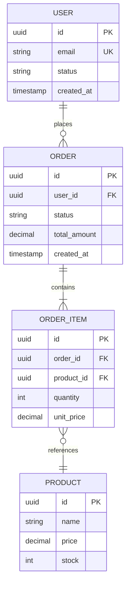

# 資料模型與遷移規範 - [專案名稱]

> **版本:** v5.0 | **更新:** 2026-07-24 | **狀態:** 範本

> 交叉引用：整體資料架構見 `05_architecture_and_design_document.md` 第 4 部分；部署/上線流程見 `14_deployment_and_operations_guide.md`。本文件聚焦「資料模型細節」與「Schema 演進如何零停機落地」。

---

## 第 1 部分：實體關係圖

- 僅畫核心聚合根與其關聯，避免全庫大圖；子模組可拆獨立圖。

---

## 第 2 部分：資料字典

- 每個核心資料表（Entity）填一份；欄位命名遵循 [snake_case/camelCase] 統一慣例。

### 表：[table_name]

| 欄位 | 型別 | 必填 | 預設值 | 說明 |
| :--- | :--- | :---: | :--- | :--- |
| id | uuid | ✅ | gen_random_uuid() | 主鍵 |
| [欄位名] | [型別] | | | [業務含義、單位、允許值範圍] |

**索引**：[列出關鍵索引與用途] | **保留策略**：[資料保留期限/歸檔規則]

---

## 第 3 部分：Data Contract

> 資料生產者與消費者之間的正式約定，變更需走通知流程，不可靜默破壞。

### 3.1 基本資訊

| 項目 | 內容 |
| :--- | :--- |
| 資料集/資料表 | [名稱] |
| 擁有者 (Owner) | [團隊/角色] |
| 消費者 (Consumers) | [下游服務/團隊清單] |
| 相容性模式 | [backward / forward / full] |

- **backward**：新 schema 可讀舊資料（消費者先升級）
- **forward**：舊 schema 可讀新資料（生產者先升級）
- **full**：新舊 schema 互相相容（最嚴格，預設建議）

### 3.2 SLA

| 指標 | 目標 |
| :--- | :--- |
| 新鮮度 (Freshness) | [如：< 5 分鐘延遲] |
| 可用性 | [如：99.9%] |
| 完整性 (Completeness) | [如：無缺漏批次] |

### 3.3 資料品質規則

| 欄位 | 規則 | 檢查方式 |
| :--- | :--- | :--- |
| [欄位] | [如：null 率 < 1%、唯一性、值域檢查] | [批次檢查/CI/監控告警] |

### 3.4 破壞性變更通知流程

- [ ] 破壞性變更（刪欄位/改型別/改語意）需提前 [N] 週通知所有消費者
- [ ] 通知管道：[Slack channel / email list / 變更日誌連結]
- [ ] 提供遷移期（新舊 schema 並存至少 [N] 個版本）
- [ ] 消費者確認遷移完成後才可下線舊 schema

### 3.5 版本歷史

| 版本 | 日期 | 變更內容 | 相容性影響 |
| :--- | :--- | :--- | :--- |
| v1.0 | YYYY-MM-DD | 初版 | - |

---

## 第 4 部分：Migration 計畫

> 採用 Expand-Contract（三階段擴張-收縮）模式，確保零停機、可隨時中止回滾。

### 4.1 變更摘要

| 項目 | 內容 |
| :--- | :--- |
| 變更目的 | [為何需要此次遷移] |
| 影響資料表 | [表名清單] |
| 預估資料量 | [列數/資料大小] |
| 下游影響評估 | [受影響的服務/報表/Data Contract 消費者] |

### 4.2 階段一：Expand（擴張）

- [ ] 新增新欄位/新表，**不刪除、不修改**既有結構
- [ ] 應用層雙寫：同時寫入舊欄位與新欄位
- [ ] 讀取仍走舊欄位（新欄位僅接收寫入，尚未啟用讀取）
- [ ] 部署後觀察期：[N 天]，確認雙寫無錯誤
- **Rollback**：關閉雙寫開關即可，新欄位保留不影響舊邏輯

### 4.3 階段二：Migrate（遷移）

- [ ] 回填 (Backfill) 歷史資料至新欄位/新表（批次任務，避免鎖表）
- [ ] 回填後執行資料一致性驗證（新舊值比對，抽樣或全量）
- [ ] 透過 feature flag 逐步切換讀取流量至新欄位（灰度：[5% → 50% → 100%]）
- [ ] 監控錯誤率/延遲，異常立即切回舊欄位讀取
- **Rollback**：feature flag 切回讀舊欄位，雙寫仍持續，資料不丟失

### 4.4 階段三：Contract（收縮）

- [ ] 確認新欄位讀取穩定運行 [N 天]，零流量走舊欄位
- [ ] 移除應用層雙寫邏輯（僅寫新欄位）
- [ ] 移除舊欄位/舊表（先標記 deprecated，觀察期後才真正 DROP）
- [ ] 清理 feature flag 與遷移用批次腳本
- **Rollback**：此階段為不可逆操作前的最後確認點；DROP 前必須有完整備份

### 4.5 N/N-1 相容性驗證

- [ ] 舊版應用程式碼 (N-1) 在 Expand/Migrate 階段仍可正常讀寫
- [ ] 新版應用程式碼 (N) 不依賴尚未回填完成的資料
- [ ] 混合版本並存期間（滾動部署）已做相容性測試

### 4.6 下游影響評估

| 下游系統/服務 | 影響方式 | 需通知 | 確認遷移完成 |
| :--- | :--- | :---: | :---: |
| [服務名] | [讀取受影響欄位/表結構變更] | ☐ | ☐ |

---

## 第 5 部分：驗收與簽核

- [ ] Data Contract 相容性模式已與消費者確認
- [ ] Migration 計畫三階段均有明確 rollback 方案
- [ ] 下游影響已評估並完成通知
- [ ] 回填/驗證腳本已通過 code review

| 角色 | 簽核人 | 日期 |
| :--- | :--- | :--- |
| 資料擁有者 | | |
| DBA / 平台團隊 | | |
