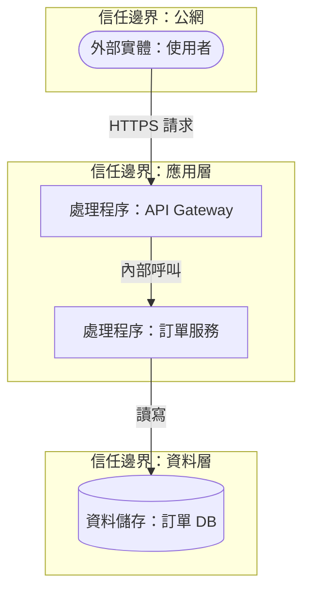

# 威脅建模文件 - [專案名稱 / 元件名稱]

> **版本:** v5.0 | **更新:** 2026-07-24 | **狀態:** 範本
> **方法論:** STRIDE | **工具:** OWASP pytm（Threat Model as Code）/ OWASP Threat Dragon（視覺化）

> 本文件產出的緩解項需回饋至 13_security_and_readiness_checklists.md 對應章節（ASVS/Top 10:2025）追蹤修復狀態。

---

## 1. 範圍與假設

| 項目 | 內容 |
| :--- | :--- |
| 建模範圍 | [系統/元件邊界，例：訂單服務 + 其資料庫，不含前端] |
| 排除範圍 | [明確排除的部分及理由] |
| 假設 | [例：內網已受防火牆保護、CI/CD 帳號受 MFA 保護] |
| 建模日期 | YYYY-MM-DD |
| 參與人員 | [架構師/開發/安全] |

---

## 2. 資料流圖（DFD）

> 標示外部實體、處理程序、資料儲存、資料流方向，以及跨越的信任邊界。

> 依實際系統調整節點與信任邊界；每條跨越信任邊界的資料流都是後續 STRIDE 分析的重點對象。

---

## 3. 資產清單

| # | 資產 | 說明 | 敏感度 | 擁有者 |
| :--- | :--- | :--- | :--- | :--- |
| A1 | [使用者憑證] | [密碼 hash、session token] | Critical | [團隊] |
| A2 | [訂單資料] | [含 PII、金額] | High | [團隊] |
| A3 | [服務可用性] | [SLA 承諾] | Medium | [團隊] |

---

## 4. STRIDE 威脅分析表

> 對每條跨信任邊界的資料流套用 STRIDE 六問；風險評級可用 H/M/L 或 DREAD 分數，依專案選定並註記於表頭。

| ID | 元件/資料流 | S | T | R | I | D | E | 描述 | 風險 | 緩解措施 | 狀態 |
| :--- | :--- | :---: | :---: | :---: | :---: | :---: | :---: | :--- | :---: | :--- | :---: |
| TH-01 | User → API Gateway | ✓ | | | | | | 使用者身分冒用（憑證竊取/重放） | High | MFA + 短 TTL token | ⏳ |
| TH-02 | API Gateway → 訂單服務 | | ✓ | | | | | 內部呼叫被竄改 | Medium | mTLS + 訊息簽章 | ⏳ |
| TH-03 | 訂單服務 → 訂單 DB | | | | ✓ | | | 資料庫存取憑證洩露導致資料外洩 | High | Secrets vault + 動態短期憑證（→ 詳見 13_security_and_readiness_checklists.md F 節） | ⏳ |
| TH-04 | API Gateway | | | | | ✓ | | 缺乏速率限制導致阻斷服務 | Medium | 速率限制 + WAF | ⏳ |
| TH-05 | 訂單服務 | | | | | | ✓ | 權限提升（普通使用者存取管理端點） | High | 物件/功能級授權檢查（ASVS V8） | ⏳ |

> **STRIDE 縮寫**：S=Spoofing 冒用｜T=Tampering 竄改｜R=Repudiation 否認｜I=Information Disclosure 資訊洩露｜D=Denial of Service 阻斷服務｜E=Elevation of Privilege 權限提升

---

## 5. 信任邊界穿越點

| 邊界 | 穿越點 | 現有控制 | 缺口 |
| :--- | :--- | :--- | :--- |
| 公網 → 應用層 | API Gateway 入口 | TLS 1.2+、認證 | [填入] |
| 應用層 → 資料層 | 服務對 DB 連線 | 網路隔離 | [填入] |

---

## 6. 緩解追蹤表

| 威脅 ID | 緩解方案 | 負責人 | 驗證方式 | 狀態 |
| :--- | :--- | :--- | :--- | :---: |
| TH-01 | 導入 MFA | [人員] | 滲透測試驗證 | ⏳ 待處理 |
| TH-03 | 遷移至動態短期憑證 | [人員] | Secrets 掃描 + 稽核日誌 | ⏳ 待處理 |

---

## 7. 殘留風險簽核

| 威脅 ID | 殘留風險說明 | 風險等級 | 接受人 | 日期 |
| :--- | :--- | :--- | :--- | :--- |
| [ID] | [已緩解但無法完全消除的風險] | [H/M/L] | [產品負責人/安全負責人] | YYYY-MM-DD |

---

## 8. 模型檔位置與重評觸發條件

| 項目 | 內容 |
| :--- | :--- |
| 模型檔案位置 | [路徑，例：`security/threat-models/order-service.py`（pytm）或 `.json`（Threat Dragon）] |
| 版本控管 | 與程式碼同 repo，走 PR 審查 |
| 重評觸發條件 | 新增跨信任邊界的資料流／導入新外部依賴／發生安全事件／每 [6 個月] 定期複查 |
| 下次排定審查 | YYYY-MM-DD |

---

## 9. 相關文件

| 文件 | 關聯 |
| :--- | :--- |
| 13_security_and_readiness_checklists.md | 緩解措施對應 ASVS/Top 10:2025 章節，供上線審查追蹤 |
| 05_architecture_and_design_document.md | DFD 節點對應系統架構圖（C4）中的元件與資料儲存 |
| 19_observability_and_slo_spec.md | 高風險威脅（如 A09/A10）需確認對應告警已覆蓋 |
