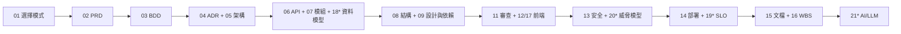

# VibeCoding 工作流程模板索引

> **版本:** v5.0 | **更新:** 2026-07-24

---

## 模板清單（20 份 = 16 必備 + 4 條件式）

### 階段 0: 總覽與工作流

| # | 檔名 | 用途 |
| :---: | :--- | :--- |
| 01 | [workflow_manual.md](./01_workflow_manual.md) | 開發流程使用說明書，demo/mvp/full 模式選擇 |

### 階段 1: 規劃 (02-03)

| # | 檔名 | 用途 |
| :---: | :--- | :--- |
| 02 | [project_brief_and_prd.md](./02_project_brief_and_prd.md) | PRD（North Star Metric、Non-Goals、RICE 優先級、Approval Gate） |
| 03 | [behavior_driven_development_guide.md](./03_behavior_driven_development_guide.md) | BDD 指南（Example Mapping、BRIEF 原則、Rule/Example Gherkin） |

### 階段 2: 架構與設計 (04-06)

| # | 檔名 | 用途 |
| :---: | :--- | :--- |
| 04 | [architecture_decision_record_template.md](./04_architecture_decision_record_template.md) | ADR 模板（MADR 4.0：frontmatter、Confirmation 欄位） |
| 05 | [architecture_and_design_document.md](./05_architecture_and_design_document.md) | 架構與設計文檔（arc42 12 章 + C4、Quality Scenarios、DDD） |
| 06 | [api_design_specification.md](./06_api_design_specification.md) | API 設計規範（OpenAPI 3.1、RFC 9457、cursor 分頁、冪等性） |

### 階段 3: 詳細設計 (07-09, 18)

| # | 檔名 | 用途 |
| :---: | :--- | :--- |
| 07 | [module_specification_and_tests.md](./07_module_specification_and_tests.md) | 模組規格與測試（CDC/Pact 契約測試、測試分層模型選擇） |
| 08 | [project_structure_guide.md](./08_project_structure_guide.md) | 專案結構指南（monorepo 決策、依領域組織） |
| 09 | [design_and_dependencies.md](./09_design_and_dependencies.md) | 設計與依賴（類別圖、SOLID、依賴倒置、Fitness Function） |
| 18* | [data_model_and_migration_spec.md](./18_data_model_and_migration_spec.md) | 資料模型與 Migration（Data Contract、Expand-Contract 三階段） |

### 階段 4: 開發與品質 (11-12, 17)

| # | 檔名 | 用途 |
| :---: | :--- | :--- |
| 11 | [code_review_and_refactoring_guide.md](./11_code_review_and_refactoring_guide.md) | 程式碼審查（Conventional Comments、審查 SLA、AI 把關） |
| 12 | [frontend_architecture_specification.md](./12_frontend_architecture_specification.md) | 前端架構規範（FSD 分層、RSC 邊界、DTCG design tokens） |
| 17 | [frontend_information_architecture_template.md](./17_frontend_information_architecture_template.md) | 前端資訊架構（導航模型、頁面↔資料對應、a11y） |

### 階段 5: 安全與部署 (13-14, 19-20)

| # | 檔名 | 用途 |
| :---: | :--- | :--- |
| 13 | [security_and_readiness_checklists.md](./13_security_and_readiness_checklists.md) | 安全檢查清單（ASVS 5.0、OWASP Top 10:2025、SBOM/SLSA） |
| 20* | [threat_model_template.md](./20_threat_model_template.md) | 威脅模型（DFD、STRIDE、緩解追蹤、殘留風險簽核） |
| 14 | [deployment_and_operations_guide.md](./14_deployment_and_operations_guide.md) | 部署與運維（PRR、Runbook、Blameless Postmortem、DORA） |
| 19* | [observability_and_slo_spec.md](./19_observability_and_slo_spec.md) | 可觀測性與 SLO（SLI/SLO、Error Budget、Burn-rate 告警、OTel） |

### 階段 6: 維護與管理 (15-16)

| # | 檔名 | 用途 |
| :---: | :--- | :--- |
| 15 | [documentation_and_maintenance_guide.md](./15_documentation_and_maintenance_guide.md) | 文檔維護（Diátaxis 四象限、docs-as-code、CI 檢查） |
| 16 | [wbs_development_plan_template.md](./16_wbs_development_plan_template.md) | WBS 開發計劃（Shape Up Pitch + WBS + 里程碑路線圖） |

### 階段 7: AI 功能 (21)

| # | 檔名 | 用途 |
| :---: | :--- | :--- |
| 21* | [ai_llm_integration_spec.md](./21_ai_llm_integration_spec.md) | AI/LLM 整合規範（Prompt 版控、Eval、Guardrails、成本預算） |

> `*` = 條件式範本，依專案特性決定是否產出：18 有資料庫演進、19 會上線維運、20 觸及認證/金流/個資必產、21 含 AI 功能。

---

## 使用流程

---

## 依角色查找

| 角色 | 常用模板 |
| :--- | :--- |
| PM / PO | 01, 02, 03, 16 |
| Tech Lead | 04, 05, 06, 11 |
| 架構師 | 05, 09, 20 |
| 後端 / 資料工程師 | 06, 07, 08, 18 |
| 前端工程師 | 12, 17 |
| 安全工程師 | 13, 20 |
| SRE / DevOps | 14, 19 |
| AI 工程師 | 21 |

---

## 版本記錄

| 版本 | 日期 | 變更 |
| :--- | :--- | :--- |
| v5.0 | 2026-07-24 | 搬遷至 `.claude/skills/project-docs/templates/`（skill 自包含）；全數升級至 2026 業界標準（MADR 4.0、arc42+C4、OpenAPI 3.1/RFC 9457、ASVS 5.0、Top 10:2025、FSD/RSC/DTCG、Example Mapping/BRIEF、CDC/Pact、Diátaxis、Shape Up）；新增條件式範本 18 資料模型、19 SLO、20 威脅模型、21 AI/LLM |
| v4.0 | 2026-04-13 | 擴展 02 PRD（+OKRs/Personas/競爭分析）、擴展 07 模組規格（+效能邊界/實際測試）、合併 09+10 為設計與依賴、強化 11 程式碼審查、刪除 output_style.md |
| v3.0 | 2026-03-16 | 全面精簡優化，移除冗餘的 01_cookbook，統一繁中 |
| v2.1 | 2025-10-03 | 新增 17_frontend_information_architecture |
| v2.0 | 2025-10-03 | 重新組織序號，新增 INDEX |
