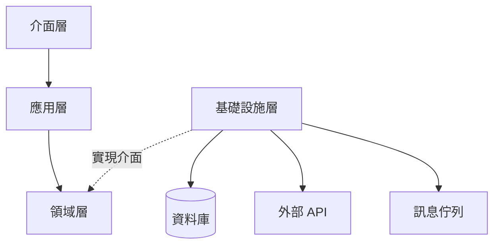
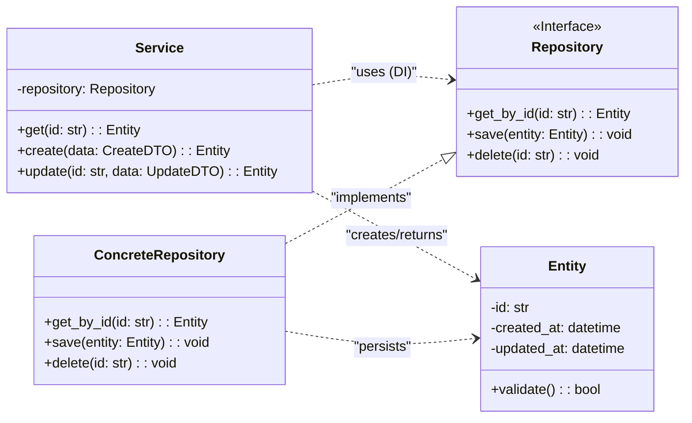

# 設計與依賴關係文件 - [專案名稱]

> **版本:** v1.0 | **更新:** YYYY-MM-DD | **狀態:** 草稿/已批准
>
> 本文件合併原「模組依賴分析」與「類別關係文件」，涵蓋架構分層、類別設計及依賴管理。

---

## 1. 架構分層與依賴規則

### 分層依賴圖



**規則**: 介面層 → 應用層 → 領域層（單向）。基礎設施層實現領域層定義的介面。

### 層級職責

| 層級 | 職責 | 程式碼路徑 | 允許依賴 |
| :--- | :--- | :--- | :--- |
| 介面層 | HTTP/gRPC 處理、序列化、認證 | `src/api/` | 應用層 |
| 應用層 | 編排業務流程、交易管理 | `src/services/` | 領域層 |
| 領域層 | 核心業務邏輯、實體、倉儲介面 | `src/domain/` | 無（最穩定） |
| 基礎設施層 | DB 存取、外部通信、快取 | `src/infrastructure/` | 領域層介面 |

### 依賴原則

| 原則 | 要點 | 違反指標 |
| :--- | :--- | :--- |
| **依賴倒置 (DIP)** | 高層依賴抽象，不依賴低層實現 | import 直接指向 infrastructure |
| **無循環依賴 (ADP)** | 依賴關係形成 DAG | 雙向 import |
| **穩定依賴 (SDP)** | 依賴方向朝向更穩定的模組 | 領域層依賴應用層 |

---

## 2. 核心類別/元件設計

### 類別圖



### 元件職責表

| 元件 | 核心職責 | 協作者 | 所屬層 |
| :--- | :--- | :--- | :--- |
| `Service` | 業務流程編排 | Repository, Entity | Application |
| `Repository` (Interface) | 持久化契約定義 | Entity | Domain |
| `ConcreteRepository` | 具體 DB/API 實現 | Entity, ORM | Infrastructure |
| `Entity` | 領域模型、業務規則 | Value Objects | Domain |

### 關係類型速查

| 關係 | UML 符號 | 意義 | 範例 |
| :--- | :--- | :--- | :--- |
| 實現 | `..\|>` | 類別 implements 介面 | `PostgresRepo ..\|> Repository` |
| 組合 | `*--` | 生命週期強綁定（整體刪除部分也刪） | `Order *-- OrderItem` |
| 聚合 | `o--` | 生命週期獨立 | `Team o-- Member` |
| 依賴 | `..>` | 方法中使用（通常透過 DI） | `Service ..> Repository` |

---

## 3. 設計模式應用

| 模式 | 應用位置 | 解決的問題 |
| :--- | :--- | :--- |
| **Repository** | 資料存取層 | 業務邏輯與儲存細節解耦 |
| **依賴注入** | Service ← Repository | 降低耦合、提高可測試性 |
| **策略模式** | [具體場景] | [運行時切換演算法] |
| **觀察者/事件** | [具體場景] | [模組間非同步通信] |
| **工廠模式** | [具體場景] | [複雜物件建立邏輯集中] |

---

## 4. SOLID 原則檢核

| 原則 | 檢查項目 | 量化指標 | 狀態 |
| :--- | :--- | :--- | :--- |
| **S** 單一職責 | 每個類別只有一個變更原因 | 類別方法數 ≤ 10、行數 ≤ 200 | [ ] |
| **O** 開放封閉 | 新增功能不修改既有程式碼 | 擴展用繼承/組合，不改原類別 | [ ] |
| **L** 里氏替換 | 子類別可安全替換父類別 | 無需 isinstance 檢查 | [ ] |
| **I** 介面隔離 | 介面小而專一 | 每個介面方法數 ≤ 5 | [ ] |
| **D** 依賴反轉 | 高層依賴抽象 | 0 個 infrastructure import in domain | [ ] |

---

## 5. 關鍵依賴路徑

### 場景: [例如：使用者下單]

```
1. api.orders.create (介面層)
   → 接收 HTTP POST、驗證 token
2. order_service.create_order (應用層)
   → 編排：驗證 → 扣庫存 → 建訂單 → 發事件
3. Order.validate() (領域層)
   → 業務規則驗證
4. OrderRepository.save() (領域介面)
   → 呼叫持久化契約
5. PostgresOrderRepo.save() (基礎設施實現)
   → 實際 DB 操作
6. EventBus.publish("order.created") (基礎設施)
   → 非同步通知下游
```

---

## 6. 外部依賴管理

### 套件依賴

| 依賴 | 版本 | 用途 | 替代方案 | 風險等級 |
| :--- | :--- | :--- | :--- | :--- |
| [套件名] | [版本] | [用途] | [替代] | 低/中/高 |

### 外部服務依賴

| 服務 | 通訊方式 | SLA | 降級策略 |
| :--- | :--- | :--- | :--- |
| [服務名] | REST/gRPC/Event | [可用性] | [快取/佇列/fallback] |

### 依賴風險緩解

| 風險 | 偵測方式 | 緩解策略 |
| :--- | :--- | :--- |
| 循環依賴 | 靜態分析工具 (madge/import-linter) | 提取共用模組 / 事件驅動解耦 |
| 不穩定外部依賴 | 健康檢查 + 斷路器 | 適配器模式封裝 + fallback |
| 過時套件 | Dependabot / Renovate | 自動 PR + CI 驗證 |

---

## 7. 介面契約

### [InterfaceName]

| 方法 | 前置條件 | 後置條件 | 複雜度 |
| :--- | :--- | :--- | :--- |
| `get_by_id(id)` | id 非空字串 | 找到回傳物件；未找到拋 NotFoundException | O(1) |
| `save(entity)` | entity 已通過 validate() | 狀態已持久化、updated_at 已更新 | O(1) |
| `find_by(filters)` | filters 為有效查詢條件 | 回傳符合條件的列表（可能為空） | O(n) |
